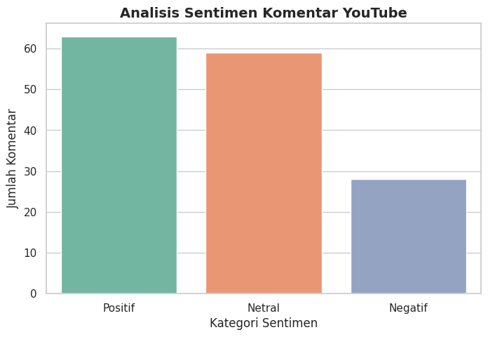
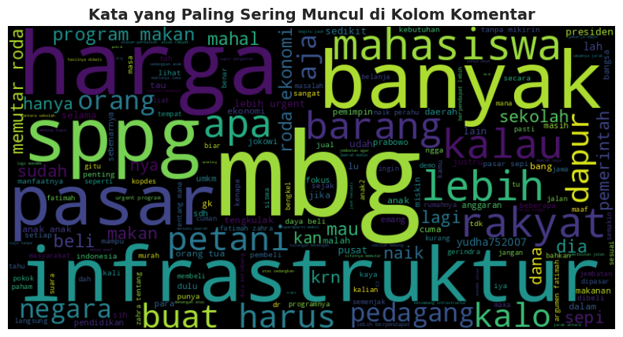

## sentiment-analysis
Youtube comment sentiment analysis

Youtube video: https://www.youtube.com/watch?v=z0PFetRQg4Q

Google Colab link: https://colab.research.google.com/drive/1dZnbP6xPRA34mEpBXKiyI5pxrs_ZZmfU?usp=sharing

## Project Overview

This project analyzes user comments collected from a public YouTube video to understand audience sentiment. The analysis includes web scraping, text preprocessing, sentiment classification, and visualization using Python.

## Objectives

- Collect comments from a YouTube video
- Clean and preprocess text data
- Translate Indonesian comments into English
- Perform sentiment analysis using TextBlob
- Visualize sentiment distribution
- Identify frequently used words using Word Cloud

## Dataset

- **Source:** YouTube
- **Comments Collected:** 150
- **Language:** Indonesian

### Dataset Preview

| Comment | Likes |
|---------|------:|
| denger "naik perahu" fatimah sampe kaget😭 krn that's the POINT infrastruktur lebih penting | 1.1K |
| fatimah azahra publik speaking nya udah bisa mantatin presiden sama wakilnya😂 | 524 |
| Bapak baju hitam punya banyak dapur di daerah Sulawesi makanya membela banget program ini | 45 |
| Dukung mahasiswa untuk indonesia lebih baik | 427 |
| PREEET itu pak siapa yg mewakili pemerintah dari gerindra... | 435 |

---

## Tools & Libraries

- Google Colab
- Pandas
- Youtube Comment Downloader
- TextBlob
- Google Translator
- Matplotlib
- Seaborn
- WordCloud

---

## Workflow

1. Scrape comments from YouTube
2. Data cleaning
3. Translate Indonesian comments into English
4. Perform sentiment analysis
5. Label comments as Positive, Neutral, or Negative
6. Visualize sentiment distribution
7. Generate Word Cloud
8. Export processed data to CSV

---

## Visualizations

### Sentiment Distribution

The majority of comments were classified as **Positive**, indicating that viewers generally responded favorably to the video.

---

### Word Cloud

The Word Cloud highlights the most frequently mentioned words in user comments, providing a quick overview of the dominant discussion topics and audience feedback.

---

## Key Findings

- Successfully scraped **150 YouTube comments** using Python.
- Translated Indonesian comments into English for sentiment analysis.
- Classified comments into **Positive**, **Neutral**, and **Negative** categories.
- Most viewer feedback expressed positive opinions toward the content.
- Generated a Word Cloud to identify the most frequently discussed topics.

---

## Result
