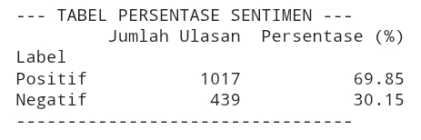
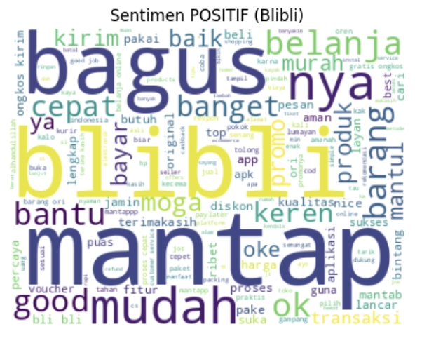
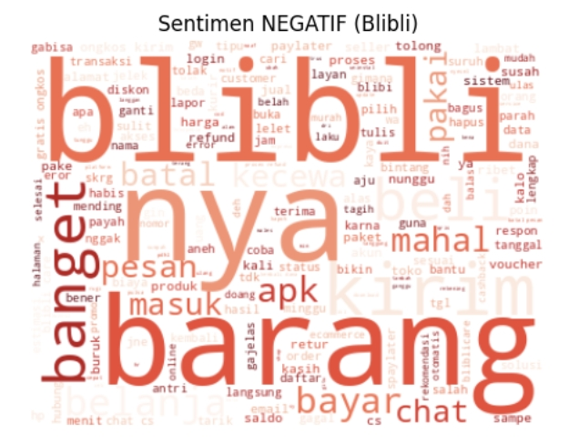
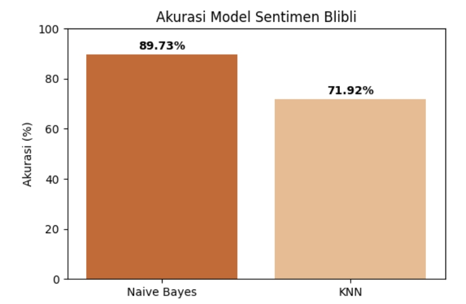
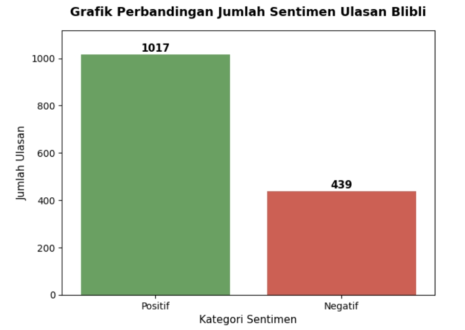

# sentiment-analysis
Google Play Review Sentiment Analysis (Blibli)

🔗 Google Colab Links: https://colab.research.google.com/drive/1oWq0mvVhD0msi9I22_KY0v6JtRdw-m2W?usp=sharing

## Project Overview

This project analyzes user reviews of the Blibli mobile application collected from the Google Play Store. The objective is to understand customer sentiment by performing text preprocessing, sentiment labeling, visualization, and machine learning classification.

## Objectives

- Collect user reviews from Google Play Store
- Clean and preprocess Indonesian text data
- Classify reviews into positive and negative sentiments
- Compare machine learning models for sentiment classification
- Visualize sentiment distribution and frequently used words

## Dataset

- **Source:** Google Play Store
- **Application:** Blibli
- **Reviews Collected:** 1500
- **Language:** Indonesian

### Dataset Preview

| Review | Rating |
|---------|--------|
| goooood | 5 |
| ada kendala stlh di update..langsung direspon sm sistem dan dibantu cari solusinya..Thanks..masalah sudah teratasi. | 1 |
| proses retur lamban | 5 |
| Pembayaran gagal terus | 2 |
| mantappppp betulllll | 5 |
| pengalaman belanja sangat baik , Customer service nya juara bagus banget. | 2 |

## Tools & Libraries

- Google Colab

## Workflow

1. Scrape user reviews from Google Play Store
2. Data cleaning
3. Text preprocessing
    - Case folding
    - Remove punctuation
    - Slang normalization
    - Tokenization
    - Stopword removal
    - Stemming (Sastrawi)
4. Sentiment labeling
5. TF-IDF feature extraction
6. Train machine learning models
7. Evaluate model performance
8. Visualize results

## Machine Learning Models

- Multinomial Naive Bayes
- K-Nearest Neighbors (KNN)

## Visualizations

### Sentiment Distribution

Approximately 69% of reviews were classified as positive, suggesting that most users had a favorable experience with the application.

### Word Cloud

Positive Reviews

The positive word cloud indicates that users generally had a satisfying shopping experience.

**Key observations:**
"mantap", "bagus", and "keren" reflect high overall customer satisfaction.
"mudah", "cepat", and "lancar" suggest that users found the application easy to use and responsive.
"promo", "diskon", and "voucher" show that promotional campaigns and competitive pricing were highly appreciated.
"terpercaya", "aman", and "original" indicate strong customer trust in product authenticity and transaction security.

Negative Reviews

The negative word cloud highlights the main issues experienced by users.

**Key observations:**
"barang", "kirim", "batal", and "retur" indicate that shipping delays, order cancellations, and return processes were common complaints.
"bayar", "refund", "saldo", and "paylater" suggest payment and refund-related issues.
"error", "login", and "apk" reveal recurring technical problems affecting user experience.
"chat" and "cs" imply dissatisfaction with customer support responsiveness.

### Model Accuracy Comparison

The Naive Bayes model outperformed KNN in this classification task, likely because Naive Bayes is well suited for sparse TF-IDF text features.

## Result

In conclusion, It is proven by the graphic that the majority reviews for Bibli application in Google Playstore are positives.
